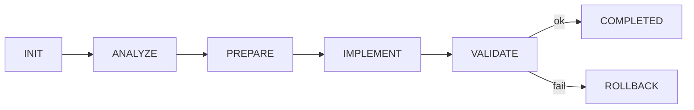

# Workflow State
<!-- STATIC:VERSION_INFO:START -->
v1.2.0 | Schema 1.2
<!-- STATIC:VERSION_INFO:END -->

<!-- STATIC:RULES:START -->
## Rules
### ANALYZE
Load config+context → infer type → set complexity(1-5) → estimate impact

### PREPARE
Resolve deps → generate plan → locate entrypoints → map tests

### IMPLEMENT
Minimal diff → strict typing → reuse utils → checkpoint C≥3

### VALIDATE
Run lint/typecheck/tests → check coverage → diff summary → rollback on fail

### Flow
INIT→ANALYZE→PREPARE→IMPLEMENT→VALIDATE→COMPLETED|ROLLBACK

### Adaptive
C≤2: fast path | C≥4: extra validation | flaky: rerun

### Rollback
IMPLEMENT fail→restore checkpoint | 2 fails→reduce complexity

### Checkpoint
C≥3: auto-create | metadata: time,phase,confidence,hash,branch

### Misc
LOG: >3K chars→archive | RISK: C≥4→static analysis | GIT: pass→commit
<!-- STATIC:RULES:END -->

<!-- STATIC:VISUALIZER:START -->
## Visualizer

<!-- STATIC:VISUALIZER:END -->

<!-- DYNAMIC:STATE:START -->
## State
Phase:INIT Status:READY
<!-- DYNAMIC:STATE:END -->

<!-- DYNAMIC:PLAN:START -->
## Plan
<!-- DYNAMIC:PLAN:END -->

<!-- DYNAMIC:ITEMS:START -->
## Items
|id|desc|status|complexity|confidence|files|
<!-- DYNAMIC:ITEMS:END -->

<!-- DYNAMIC:METRICS:START -->
## Metrics
Tasks:0/0 | Quality:0 errors | Diff:0 files
<!-- DYNAMIC:METRICS:END -->

<!-- DYNAMIC:CHECKPOINTS:START -->
## Checkpoints
|time|phase|confidence|hash|branch|
<!-- DYNAMIC:CHECKPOINTS:END -->

<!-- DYNAMIC:LOG:START -->
## Log
<!-- DYNAMIC:LOG:END -->

<!-- DYNAMIC:HISTORY:START -->
## History
<!-- DYNAMIC:HISTORY:END -->
